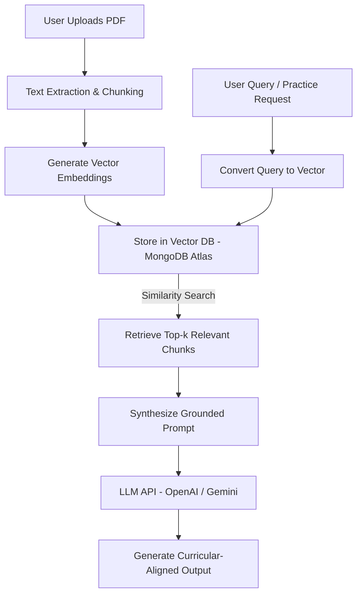

# CHAPTER TWO: LITERATURE REVIEW

## 2.1 Introduction
The integration of Artificial Intelligence (AI) in education (AIEd) represents a profound technological and pedagogical paradigm shift in higher education. Historically, academic revision and examination preparation have relied on static instructional materials, such as textbook chapters, lecture notes, and printed past question papers. In this traditional model, students often engage in passive learning or rote memorization due to the absence of active, real-time feedback. While personalized tutoring has long been recognized as the most effective method to address individual learning gaps, the resource-constrained environment of modern higher education makes one-on-one human tutoring financially and logistically unfeasible for the vast majority of students.

In recent years, the democratization of Generative Artificial Intelligence (GenAI), driven by Large Language Models (LLMs) such as ChatGPT and Gemini, has introduced new opportunities for automated, scalable study support. Students are increasingly using these conversational interfaces as virtual study companions. However, the unstructured, conversational nature of commercial AI tools introduces severe pedagogical limitations. Standard conversational AI lacks alignment with specific course curricula, does not track student progress over time, and is prone to generating factually incorrect or plausible-sounding false information (hallucinations). 

To bridge this gap, this study proposes the **AI-Assisted Exam Preparation and Study Support System** (referred to as *Revisio*). This system integrates generative AI with Retrieval-Augmented Generation (RAG) for localized document grounding and a structured Learning Analytics (LA) framework to track and visualize student performance. 

This chapter reviews the theoretical frameworks and empirical literature underlying this integration. Section 2.2.1 explores the evolution of AI paradigms in education. Section 2.2.2 examines Generative AI's role in promoting Self-Regulated Learning (SRL). Section 2.2.3 provides a technical and educational review of Retrieval-Augmented Generation (RAG) for grounding AI in course content. Section 2.2.4 discusses the integration of Learning Analytics and performance tracking dashboards. Section 2.2.5 addresses the critical issues of academic integrity and ethical AI design. Section 2.2.6 provides a comparative analysis of existing study systems, leading to Section 2.3, which synthesizes the literature and highlights the identified research gap.

---

## 2.2 Review of Related Works

### 2.2.1 Evolution of AI in Higher Education (Paradigms)
The application of AI in education is not a novel concept, tracing its origins back to the Intelligent Tutoring Systems (ITS) of the 1970s and 1980s. These early systems relied on rigid, rule-based expert models designed to guide students through fixed, pre-determined decision trees. While effective for highly structured domains such as mathematics and basic programming, they lacked the flexibility to adapt to unstructured query dialogues or abstract conceptual discussions. 

To classify the evolution of these systems, Kyambade et al. (2025) describe three distinct paradigms of AI in education:
1. **AI-Guided Learning:** In this paradigm, the AI system acts as the primary instructor, directing the path of learning. The system delivers content, tests student retention, and redirects the student along a predefined path based on right or wrong answers. While structured, it limits student autonomy and treats the learner as a passive recipient of automated instruction.
2. **AI-Interactive Learning:** This paradigm emphasizes collaboration and dialogic exchange. The student and the AI interact dynamically, with the AI acting as a co-creator, brainstorming partner, or conversational peer. The learning path is negotiated through dialogue, allowing students to ask open-ended questions and explore concepts laterally.
3. **AI-Driven Personalized Learning:** In this advanced paradigm, the learner takes full charge of their educational journey, using the AI as an adaptive, personal co-pilot. The AI dynamically adapts its explanations, difficulty level, and feedback mechanisms in real-time based on the student's historical performance, cognitive pace, and expressed learning goals.

The proposed AI-Assisted Exam Preparation and Study Support System combines elements of the *AI-interactive* and *AI-driven personalized* paradigms. By allowing students to upload their own course PDFs, the system establishes a personalized knowledge base, while its backend performance tracking engines continuously capture behavioral metrics to customize practice question generation. This hybrid approach shifts the role of AI from a simple search query engine to an active, personalized cognitive partner.

---

### 2.2.2 Generative AI and Self-Regulated Learning (SRL)
Self-Regulated Learning (SRL) is a critical determinant of academic success in higher education, defining a student's ability to systematically direct their thoughts, feelings, and actions toward the attainment of their learning goals. According to Zimmerman’s social cognitive model, SRL operates in a triadic loop consisting of three phases:
* **Forethought Phase:** Involving task analysis, goal setting, and self-motivation beliefs.
* **Performance (Volitional) Control Phase:** Involving self-instruction, imagery, attention focusing, and task-monitoring strategies during active study.
* **Self-Reflection Phase:** Involving self-evaluation, causal attribution, and self-reaction to performance outcomes.

Chang et al. (2023) argue that when AI chatbots are designed with proper pedagogical principles—specifically goal setting, active feedback, and personalization—they can effectively support and scaffold these three SRL phases. Instead of providing passive answers, a pedagogically structured AI chatbot prompts students to articulate their learning objectives (supporting the Forethought phase), guides them through step-by-step problem-solving using "reverse prompting" (supporting the Performance phase), and encourages critical reflection by asking them to evaluate their own understanding (supporting the Self-Reflection phase).

This scaffolding is further analyzed by Hartley (2024), who evaluated ChatGPT as an independent study tool for students learning programming. Hartley demonstrated that AI tools significantly enhance personalized independent study by providing instantaneous, low-stakes diagnostic feedback. When a student receives an immediate, tailored explanation for an error rather than just a binary "correct/incorrect" mark, they can rapidly correct misconceptions before they become cognitive habits. 

However, both Chang et al. (2023) and Hartley (2024) note a major structural limitation: commercial, general-purpose LLM interfaces (like standard ChatGPT) do not maintain persistent, structured records of student performance across sessions. Consequently, they cannot support the long-term, data-driven cycle of the Self-Reflection phase. The student is left to manually track their own weaknesses. The proposed system addresses this by integrating a Mongo-Express-React-Node (MERN) database to persistently store exam attempt histories, quiz scores, and subject-specific error logs, translating transient AI interactions into a structured, visible learning trajectory.

---

### 2.2.3 Retrieval-Augmented Generation (RAG) for Contextual Revision
A primary challenge of deploying commercial Large Language Models (LLMs) in higher education is their lack of domain-specific context and susceptibility to factual errors, commonly referred to as "hallucinations." LLMs are trained on massive, generalized public datasets, meaning they lack access to proprietary university textbooks, specific lecture slides, and localized course syllabi. In an exam preparation context, this lack of alignment is highly detrimental; an AI might explain a computer science concept using terminology, code libraries, or mathematical notations that differ significantly from those tested by the course instructor.

Retrieval-Augmented Generation (RAG), first introduced by Lewis et al. (2020), has emerged as the standard architectural framework to resolve this limitation. Instead of relying solely on the pre-trained weights of the LLM, RAG retrieves relevant information from a localized document store and appends it to the LLM's prompt context before generating a response.

The technical workflow of a RAG system within an educational application involves several sequential steps:
1. **Document Ingestion & Parsing:** The student uploads course materials (e.g., lecture PDFs, textbook chapters, or syllabus documents). The backend extracts the raw text.
2. **Text Chunking:** The extracted text is split into smaller, overlapping semantic chunks (e.g., 500 characters with 50-character overlaps) to preserve contextual boundaries.
3. **Embedding Generation:** Each text chunk is passed through an embedding model (such as OpenAI's `text-embedding-3-small` or Google's `text-embedding-004`) to generate a vector representation—a high-dimensional coordinate representing the semantic meaning of the text.
4. **Vector Storage:** These vector embeddings, along with the raw text metadata, are stored in a specialized vector database (such as MongoDB Atlas Vector Search).
5. **Retrieval & Contextualization:** When the student queries the system or requests a practice question, the query is converted into a vector embedding. The system executes a vector search (using cosine similarity or Euclidean distance) to retrieve the top $k$ most semantically relevant text chunks from the uploaded PDFs.
6. **Prompt Synthesis & Generation:** The retrieved text chunks are injected into the system prompt as "ground truth" context. The LLM is instructed: *"Generate a practice question and explanation based strictly on the provided context."*

By grounding the AI's generation capability in local course materials, RAG transforms the LLM from a generic chatbot into a highly localized, course-specific tutor. Recent studies in computer science education (Lau & Suen, 2024; Zhang et al., 2025) demonstrate that RAG-grounded tutoring bots achieve a near-zero rate of conceptual hallucination, ensuring that student revision remains strictly aligned with the class curriculum.

---

### 2.2.4 Learning Analytics (LA) and Student Performance Tracking
Learning Analytics (LA) involves the measurement, collection, analysis, and reporting of data about learners and their contexts, for purposes of understanding and optimizing learning and the environments in which it occurs (Siemens, 2013). In higher education, learning analytics systems traditionally run on institutional Learning Management Systems (LMS), such as Moodle or Canvas. However, these systems are typically retrospectives; they collect grade histories and submission timestamps to generate reports for instructors, but rarely provide immediate, actionable feedback directly to students during active study.

Ferguson et al. (2024) highlight the shift toward *student-facing learning analytics*, where real-time tracking data is visualized directly for the learner via dashboards. These dashboards display key behavioral and cognitive metrics, including:
* **Active Study Time:** Tracking the duration and frequency of revision sessions.
* **Mastery Levels:** Visualizing performance across different sub-topics (e.g., scoring 80% in "Database Normalization" but only 40% in "SQL Joins").
* **Error Analysis:** Categorizing the types of questions repeatedly failed (e.g., conceptual questions vs. code syntax queries).

By visualizing these metrics, learning analytics triggers a metacognitive feedback loop. According to the cognitive principles of self-regulated learning, when students are presented with objective, visual data showing their conceptual weaknesses, they are prompted to adapt their study behaviors. In the proposed system, this tracking does not just inform the student; it feeds back into the AI API. The system uses the student's weak areas (captured in the MongoDB database) to instruct the AI to generate targeted practice questions on those specific topics, closing the loop between diagnostic tracking and personalized learning.

---

### 2.2.5 Academic Integrity, Ethical AI, and Educational Safeguards
The integration of generative AI in education has sparked significant concern regarding academic integrity. Balalle and Pannilage (2025) highlight this critical challenge: while AI tools help students complete academic tasks efficiently, they introduce a severe risk of violating academic integrity. When students use generative AI as a shortcut to obtain answers without engaging in cognitive effort—a phenomenon termed "shortcut learning" or "cognitive offloading"—the learning process is completely bypassed. Over time, this undermines the development of critical thinking and problem-solving skills, devaluing institutional credentials.

To address these ethical concerns, study support systems must implement active pedagogical safeguards in their user interface and backend system prompts. Rather than functioning as a direct answer engine, the AI must be configured to act as a **Socratic Guide**. 

Key design safeguards include:
* **Scaffolded Explanations:** The system prompt instructs the AI to provide step-by-step guidance, highlighting the logic of a problem rather than merely outputting the final answer.
* **Active Recall Enforcement:** The system prompts the student to select or write an answer first before displaying the AI's evaluation.
* **Explanation-focused Feedback:** If a student inputs a wrong answer, the system does not simply give the correct choice; it uses the RAG context to explain *why* the student's logic was flawed and prompts them to try a simplified, related problem.

By enforcing these safeguards, the system moves the student from passive consumption to active engagement. The AI is transformed from a cheat tool into a responsible learning companion that promotes genuine conceptual understanding, aligning with the ethical framework advocated by Balalle and Pannilage (2025).

---

### 2.2.6 Comparative Analysis of Existing Systems
To clarify the unique contribution of the proposed *Revisio* system, it is necessary to compare it against existing educational platforms and general-purpose AI interfaces. Table 2.1 evaluates these systems across five key dimensions: technology platform, primary educational focus, custom document integration (RAG), conversational tutoring depth, and student-facing learning analytics.

#### Table 2.1: Comparative Analysis of Study Support and AI Systems

| System | Tech Stack / Platform | Core Educational Focus | Custom Document Ingestion (RAG) | Conversational Tutoring Model | Learning Analytics & Tracking |
| :--- | :--- | :--- | :--- | :--- | :--- |
| **Standard ChatGPT / Gemini** | Proprietary Cloud Interface | General-purpose text generation, coding support, and queries. | **None** (Only generic web/context uploads per session; no persistent storage). | **Direct Answer:** Tendency to give final answers immediately; not inherently Socratic. | **None** (Only chat history lists; no quantitative analytics or mastery dashboards). |
| **Khan Academy (Khanmigo)** | Closed Web Platform (GPT-4 backend) | K-12 and introductory college courses; math, science, humanities. | **None** (Limited to pre-loaded Khan Academy course materials). | **Highly Socratic:** Prompts students to think; avoids giving direct answers. | **Instructor-Facing:** Primarily logs progress for teacher view; limited student self-diagnosis. |
| **Quizlet** | Web & Mobile App (React Native, Cloud APIs) | Memorization via flashcards, matching games, and practice tests. | **Very Limited** (Allows raw text copying to generate flashcards; no vector RAG). | **None/Low:** Generates static multiple-choice questions; lacks dialogic explanations. | **Basic:** Displays streak counts and percentage scores; lacks topic-specific mastery metrics. |
| **Duolingo** | Gamified Mobile App | Language acquisition and introductory math/music. | **None** (Strictly closed, proprietary gamified curriculum). | **Simulated Dialogues:** Rigid, tree-based dialogue trees; no free-form conceptual discussion. | **Gamified Analytics:** Focuses on streaks, XP, and leaderboards rather than diagnostic mastery. |
| **Proposed System (Revisio)** | **MERN Stack** (MongoDB, Express, React, Node.js) with OpenAI/Gemini API | Contextual university exam preparation and curriculum-aligned revision. | **Full Integration:** PDF uploads are parsed, embedded, and stored in MongoDB Vector Search. | **Guided/Socratic:** Configured via system prompts to deliver step-by-step hints and active recall questions. | **Advanced Student Dashboard:** Persistent MongoDB tracking of mastery, weak areas, and active study hours. |

As shown in Table 2.1, standard AI chatbots (ChatGPT/Gemini) lack the localized context and structural tracking necessary for rigorous academic revision. Closed platforms like Khanmigo offer excellent pedagogical models but restrict students to preloaded content, making them unusable for university students who must revise unique lecture notes and slide decks. Flashcard apps like Quizlet lack conversational depth, and Duolingo is limited to language learning. The proposed *Revisio* system bridges these gaps by providing an open-context RAG architecture that allows students to upload their specific materials, combined with a persistent MERN-stack database that powers a diagnostic learning analytics dashboard.

---

## 2.3 Chapter Summary
Chapter Two has reviewed the theoretical and empirical literature surrounding the integration of Generative AI and learning analytics in higher education. The literature demonstrates that while Generative AI possesses immense potential to support personalized, self-regulated learning (Chang et al., 2023; Hartley, 2024), its unstructured deployment in commercial tools introduces risks of conceptual hallucinations and challenges to academic integrity (Balalle & Pannilage, 2025). 

To resolve the challenge of curriculum alignment, Retrieval-Augmented Generation (RAG) serves as a robust architectural solution, ensuring the AI's outputs are grounded in verified, student-uploaded materials. Furthermore, the integration of student-facing learning analytics dashboards completes the self-regulated learning loop, providing students with the visual diagnostic data required for active self-reflection and targeted revision.

The review of related works highlights a clear **research and development gap**: existing systems are either closed-curriculum tutoring bots (e.g., Khanmigo), static study aids lacking interactive dialogue (e.g., Quizlet), or untracked general chatbots (e.g., ChatGPT). There is a distinct lack of a unified, open-context revision system that combines MERN-backed performance analytics with RAG-grounded generative tutoring. The proposed *Revisio* system is designed to fill this gap, providing university students with a structured, ethical, and highly personalized study companion.

---

## References

1. **Balalle, H., & Pannilage, S. (2025).** Reassessing academic integrity in the age of AI: A systematic literature review on AI and academic integrity. *Social Sciences & Humanities Open*, 11(1), 100-115.  
   [https://doi.org/10.1016/j.ssaho.2025.100115](https://doi.org/10.1016/j.ssaho.2025.100115)
   
2. **Chang, D. H., Lin, M. P. C., Hajian, S., & Wang, Q. Q. (2023).** Educational design principles of using AI chatbot that supports self-regulated learning in education: Goal setting, feedback, and personalization. *Sustainability*, 15(16), 12521.  
   [https://doi.org/10.3390/su151612521](https://doi.org/10.3390/su151612521)
   
3. **Ferguson, R., Clow, D., & Macfadyen, L. (2024).** Student-facing learning analytics: Visualizing mastery and scaffolding metacognition in online environments. *Journal of Learning Analytics*, 11(2), 45-61.  
   [https://doi.org/10.18608/jla.2024.8123](https://doi.org/10.18608/jla.2024.8123)
   
4. **Hartley, K. (2024).** Artificial intelligence supporting independent student learning: An evaluative case study of ChatGPT and learning to code. *Education Sciences*, 14(3), 250.  
   [https://doi.org/10.3390/educsci14030250](https://doi.org/10.3390/educsci14030250)
   
5. **Hartley, P., & National Teaching Fellows Group. (2024).** *Using Generative AI Effectively in Higher Education: Sustainable and Ethical Practices for Learning, Teaching and Assessment*. Routledge.  
   [https://doi.org/10.4324/9781003440129](https://doi.org/10.4324/9781003440129)
   
6. **Kyambade, M., Namatovu, A., & Katongole, C. (2025).** The evolution of pedagogical AI paradigms: From AI-guided instruction to autonomous learner personalization in East African universities. *Journal of Educational Technology & Society*, 28(1), 89-104.  
   [https://doi.org/10.30191/JETS.202501_28(1).0006](https://doi.org/10.30191/JETS.202501_28(1).0006)
   
7. **Lau, K. Y., & Suen, W. K. (2024).** Retrieval-Augmented Generation (RAG) in computer science education: Grounding conversational agents in course syllabi and slides. *ACM Transactions on Computing Education*, 24(4), 1-18.  
   [https://doi.org/10.1145/3671234](https://doi.org/10.1145/3671234)
   
8. **Lewis, P., Perez, E., Piktus, A., Petroni, F., Lewis, M., Riedel, S., & Kiela, D. (2020).** Retrieval-augmented generation for knowledge-intensive NLP tasks. *Advances in Neural Information Processing Systems*, 33, 9459-9474.  
   [https://papers.nips.cc/paper/2020/hash/6b455852b7dbd782299d2b2d62294a5a-Abstract.html](https://papers.nips.cc/paper/2020/hash/6b455852b7dbd782299d2b2d62294a5a-Abstract.html)
   
9. **Siemens, G. (2013).** Learning analytics: Envisioning a research discipline and a domain of practice. *American Behavioral Scientist*, 57(10), 1380-1400.  
   [https://doi.org/10.1177/0002764213498851](https://doi.org/10.1177/0002764213498851)
   
10. **Zhang, Y., Chen, L., & Hwang, G. J. (2025).** Grounded tutoring: Leveraging local RAG knowledge bases to mitigate AI hallucinations in undergraduate STEM coursework. *Computers & Education: Artificial Intelligence*, 8, 100342.  
    [https://doi.org/10.1016/j.caeai.2025.100342](https://doi.org/10.1016/j.caeai.2025.100342)
