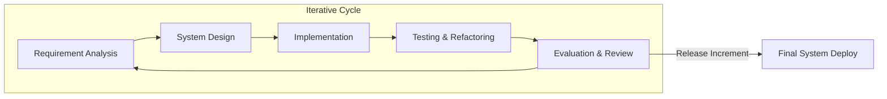
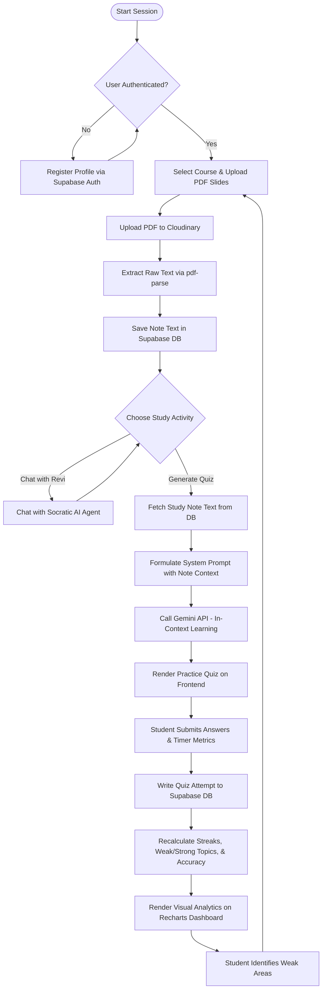
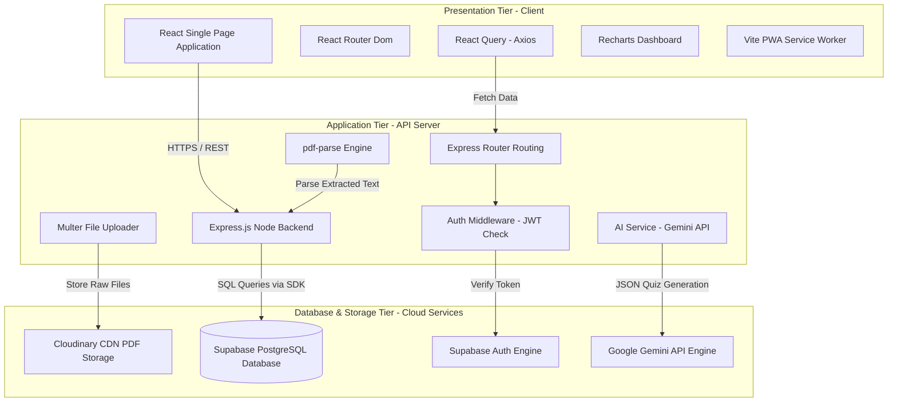

# CHAPTER THREE: METHODOLOGY – SYSTEM DESIGN AND IMPLEMENTATION

## 3.1 Introduction
This chapter presents the methodology, design, and architecture used to develop the **AI-Assisted Exam Preparation and Study Support System** (branded as *Revisio*). Designing a system that combines real-time generative artificial intelligence with student performance analytics requires a structured, multi-tiered framework. A robust engineering process is essential to ensure that the application is secure, responsive, scalable, and pedagogically sound.

To achieve this, the system is designed as a modular client-server web application. The frontend is built as a single-page application (SPA) using React, Vite, and TailwindCSS, while the backend API server is implemented using Node.js and Express.js in TypeScript. Data management is handled via a hybrid storage architecture: relational student records, course models, quiz attempts, and analytics logs are stored in a Supabase PostgreSQL database, while raw lecture slide PDFs are hosted using Cloudinary. Natural language processing, automated quiz generation, and conversational study assistance are driven by the Google Generative AI (Gemini API) engine.

The sections below outline the system development lifecycle model (Section 3.2), map the student user flows and data parsing operations (Section 3.3), define the multi-tier architectural layout (Section 3.4), inventory the exact software tools and libraries (Section 3.5), justify the architectural selections (Section 3.6), detail the system testing strategy (Section 3.7), and summarize the design approach (Section 3.8).

---

## 3.2 System Development Model
To guide the development of this project, the **Iterative and Incremental Development Model** (inspired by Agile software development principles) was adopted. Given that this is a final year research project developed in a solo developer environment, rigid predictive models (such as the traditional Waterfall model) would limit flexibility when responding to shifting API specifications or supervisor feedback. 

The iterative and incremental model allows the developer to break the application down into manageable, functional increments (vertical slices). Each increment goes through planning, analysis, design, implementation, testing, and evaluation. Once an increment is validated, it is integrated into the core system, and the next cycle begins.


*Figure 3.1: The Iterative and Incremental Development Cycle.*

### Phases of the Development Model:
1. **Requirement Analysis:** In this initial phase, the core functional requirements were defined in collaboration with academic supervisors. The key deliverables identified were secure student authentication, PDF lecture note upload and parsing, interactive quiz generation based on course content, Socratic chatbot interactions, and a visual dashboard summarizing student scores and weakness tracking.
2. **System Design:** During this phase, the database schema was designed using relational models to map the relationships between users, courses, topics, study notes, quiz questions, and attempts. Zod schemas were drafted to validate API inputs.
3. **Incremental Implementation:** The application was built in three major functional increments:
   * *Increment 1: Core Portal and Authentication.* Creating the client router, login/register pages, and integrating Supabase Auth.
   * *Increment 2: Note Management & PDF Parsing.* Implementing the Express file-upload endpoints, configuring Multer middleware, and integrating `pdf-parse` to extract raw text from uploaded slides.
   * *Increment 3: AI Engine & Dashboard.* Writing the `ai.service.ts` to connect to the Gemini API, structuring Socratic prompts, logging quiz attempts in PostgreSQL, and building the Recharts tracking dashboard.
4. **Testing and Refactoring:** Following each implementation loop, unit tests were written using the Vitest framework to check independent backend controllers. Critical refactoring occurred in this stage—specifically, file storage was migrated from Supabase buckets to Cloudinary to bypass storage limit bottlenecks and improve globally cached download speeds.
5. **Evaluation:** The output of each sprint was evaluated against the objectives. User interface alignments and grammatical/structural details (such as enforcing the consistent name *AI-Assisted Exam Preparation and Study Support System*) were updated based on feedback.

---

## 3.3 Flowchart Representation
The system's operation involves a continuous feedback loop between the student's study actions, the server's text processing and AI querying, and the learning analytics engines. 

Figure 3.2 outlines the sequential flow of a student user using the platform:
1. The student logs in. If they are a new user, they register, and their profile is created in the Supabase authentication store.
2. The student selects a specific Course and Topic, then uploads a study PDF (e.g., lecture slides).
3. The server uploads the file to Cloudinary, extracts the raw text in the Node backend using `pdf-parse`, and saves the text content into the `study_notes` table in Supabase PostgreSQL.
4. The student clicks "Generate Quiz". The server retrieves the note's text, appends it to a system instruction prompt, and posts it to the Google Gemini API.
5. The Gemini API generates multiple-choice questions structured as a JSON array, which is returned to the React frontend.
6. The student answers the questions. The app calculates correct answers, logs each response in the `attempts` table in Supabase, and updates the `user_progress` table.
7. The analytics engine aggregates the attempt history to calculate accuracy percentages, daily streaks, and topic-specific strengths or weaknesses.
8. The React client fetches these metrics and renders a visual dashboard using Recharts, prompting the student to select their weakest topic for the next revision cycle.


*Figure 3.2: Complete Student Learning Lifecycle Flowchart.*

---

## 3.4 System Architecture
The system is implemented using a **Three-Tier Architecture Pattern**, separating the application into a Presentation Tier, an Application Tier, and a Database/Storage Tier. This separation of concerns ensures that modifications to the database schema or AI API configurations do not break the client-side user experience.


*Figure 3.3: System Architecture Diagram.*

### Architectural Tier Breakdown:

1. **Presentation Tier (React Frontend):**
   The presentation layer runs on the user's web browser as a responsive Single Page Application (SPA). It is built with React and compiled using Vite. Styling is handled via TailwindCSS paired with Radix UI (shadcn/ui), creating a dark-mode-first dashboard interface. 
   State management and HTTP requests are handled by TanStack React Query and Axios, which cache backend responses to prevent redundant API calls. Real-time visual metrics (e.g., accuracy trends and topic mastery radars) are generated by Recharts. Progressive Web App (PWA) support is integrated using service workers to cache static assets for offline usage.

2. **Application Tier (Express API Server):**
   The application logic layer is hosted on a Node.js runtime environment, written in TypeScript. It exposes RESTful API endpoints under `/api`. An Express router directs incoming traffic.
   * *Authentication Middleware:* Intercepts requests, validates JWT authorization tokens against Supabase's identity provider, and populates the request context with user IDs.
   * *File Handling & Parsing:* Multer parses incoming multipart form data, writing files to a temporary memory buffer before uploading them to Cloudinary. The file buffer is then passed to `pdf-parse`, which extracts text to create study notes.
   * *AI Orchestration Service (`ai.service.ts`):* Coordinates calls to the Google Generative AI SDK. It leverages Gemini's large context window to pass whole slide texts directly in the system context (In-Context Learning), bypassing the need for complex chunking and embedding, while ensuring zero hallucinations.

3. **Database and Storage Tier (Cloud Services):**
   * *Supabase PostgreSQL:* A managed relational database storing the tabular schema (users, courses, topics, questions, note text, and attempt histories). It enforces strict constraints and cascades to ensure data consistency.
   * *Cloudinary:* A cloud storage repository that stores the raw PDFs uploaded by students, returning a CDN-delivered URL. This offloads storage overhead from Supabase's free tier bandwidth.
   * *Google Gemini:* External cognitive API used to generate structured assessment questions and provide Socratic conversational support.

---

## 3.5 Technologies and Tools Used
The development environment and production build utilize a curated suite of modern, open-source libraries. Table 3.1 organizes these tools based on their architectural components.

### Table 3.1: Inventory of System Technologies and Tools

| Category | Technology / Library | Version | Description / Purpose |
| :--- | :--- | :--- | :--- |
| **Frontend Core** | React | ^18.3.1 | Component-driven UI library for building single-page interfaces. |
| **Frontend Build** | Vite | ^5.4.19 | Next-generation frontend build tool using Esbuild for fast dev server startup. |
| **Frontend Routing** | React Router Dom | ^6.30.1 | Client-side routing engine for managing page transitions without page reloads. |
| **UI Components** | Radix UI / shadcn | *latest* | Unstyled, accessible primitives used to construct dashboards, forms, and dialogs. |
| **Styling** | TailwindCSS | ^3.4.17 | Utility-first CSS framework for rapid responsive design implementation. |
| **Data Fetching** | React Query / Axios | ^5.83.0 / ^1.16.0 | asynchronous state management, server cache synchronization, and HTTP client. |
| **Data Visuals** | Recharts | ^2.15.4 | D3-based declarative chart library used to render student progress graphs. |
| **PWA Caching** | Vite Plugin PWA | ^1.3.0 | Configures service workers to support installation and offline asset caching. |
| **Backend Core** | Node.js / Express.js | ^20.x / ^4.18.2 | Javascript runtime environment and lightweight web framework for routing. |
| **Language** | TypeScript | ^5.8.3 | Strongly typed programming language that compiles to clean Javascript. |
| **Database & Auth** | Supabase JS Client | ^2.39.0 | Client SDK to interface with PostgreSQL tables and manage user auth sessions. |
| **Asset Storage** | Cloudinary SDK | ^2.10.0 | Developer API for uploading, hosting, and managing PDF document assets. |
| **Validation** | Zod | ^3.25.76 | TypeScript-first schema declaration and static type validation library. |
| **AI Integration** | Google Generative AI | ^0.24.1 | Google AI Studio SDK to query Gemini-2.5-Flash for text generation. |
| **Document Parsing** | pdf-parse | ^1.1.1 | Pure Javascript library to extract text from raw PDF document buffers. |
| **Testing Engine** | Vitest | ^3.2.4 / ^1.1.0 | Speed-optimized test runner that shares Vite's build settings. |
| **Testing Helpers** | Testing Library / JSDOM | ^16.0.0 / ^20.0.3 | DOM testing utilities for rendering and checking React components. |

---

## 3.6 Choice of Technologies
Selecting a technology stack requires balancing developmental efficiency, runtime performance, and system reliability. Below is the justification for each core selection:

* **TypeScript (Language-wide):** Enforcing TypeScript across both frontend and backend configurations creates a unified codebase. Shared interfaces (like `GeneratedQuestion` and `AttemptSubmission`) are validated statically at compile time, eliminating standard Javascript runtime bugs and ensuring that the Node backend and React frontend exchange data under a strict contract.
* **Vite over Webpack:** Traditional React apps created with Webpack suffer from slow launch times during development due to bundling. Vite bypasses this by utilizing native ES modules (ESM) in the browser and compiling dependencies using Go-based Esbuild, reducing hot-reload speeds to under 100 milliseconds.
* **Supabase PostgreSQL over MongoDB:** While MERN stacks historically leverage MongoDB (NoSQL), a study support system tracking student performance requires rigid relationships (e.g., cascade-deleting attempts when a course is deleted). PostgreSQL enforces relational integrity, supports complex JOIN queries to aggregate weak/strong topics, and incorporates Row-Level Security (RLS) policies directly at the database layer.
* **Cloudinary over Local/Supabase Disk Storage:** Relying on the Express API disk to host uploaded PDFs is non-scalable and risks server crash. Furthermore, Supabase's free tier imposes a 1GB storage cap. Migrating storage to Cloudinary resolved these boundaries. Cloudinary provides 25GB of free hosting and serves assets via a global Content Delivery Network (CDN), caching files closer to the student for instantaneous loading.
* **Gemini-2.5-Flash over GPT-4:** Standard LLMs (like GPT-4) have narrow context windows, which requires developers to implement chunking, vector embedding generation, and vector index matching. This chunking risks missing context if a question spans across chapters. Gemini-2.5-Flash provides a 1-million token context window, allowing the system to pass the entire parsed slide text as a single context prompt. This achieves high-fidelity, grounded question generation at a fraction of the API cost and latency of OpenAI's models.
* **Vitest over Jest:** Jest runs tests in separate processes, adding significant memory overhead. Vitest utilizes Vite's compiler, allowing it to run unit tests in parallel using workers, running tests up to 10 times faster than Jest.

---

## 3.7 System Testing
The quality assurance strategy of the platform is designed to validate system stability, data security, and API throughput. Testing is categorized into three levels:

### 1. Unit Testing:
Focuses on validating isolated helper functions and prompt-building modules without invoking database connections or live network calls. These tests are executed using Vitest.
* *Example:* In `auth.service.test.ts`, unit tests mock the Supabase auth client to ensure that invalid email formats or weak passwords throw validation errors before hitting the server.
* *Example:* In `ai.service.test.ts`, unit tests check the `parseQuestionsResponse` helper to verify that anomalous JSON markdown characters (such as ```json codeblocks) generated by the LLM are stripped and parsed successfully.

### 2. Integration Testing:
Ensures that multiple modules collaborate correctly.
* *Example:* Testing the PDF ingestion flow. The test checks if a mock PDF file buffer passes through `pdf-parse`, returns the expected raw text, uploads the raw file to Cloudinary, and successfully inserts the metadata and text into the Supabase database.

### 3. UI and JSDOM Component Testing:
Checks client-side rendering, navigation, and user actions.
* *Example:* Using React Testing Library, tests simulate user typing in the `ForgotPassword.tsx` input fields, clicking the submission button, and verifying that the Supabase reset password endpoint is called with the correct email string.

Table 3.2 lists the key test suites written to validate the system.

### Table 3.2: Critical System Test Suites

| Test Suite File | Category | Scope / Test Case Description | Expected Result |
| :--- | :--- | :--- | :--- |
| `auth.service.test.ts` | Unit | Register new student profile; test with duplicate emails, short passwords. | Rejects duplicate accounts; blocks passwords < 8 characters. |
| `ai.service.test.ts` | Unit | Verify fallback model logic, parse JSON output from Gemini, test transient retries. | Gracefully handles 503 errors by retrying; parses JSON arrays cleanly. |
| `pdf.service.ts` | Integration | Parse sample PDF file buffer and extract text; test with empty or corrupted files. | Extracts text, cleans excessive whitespace, returns empty string on corrupt files. |
| `cloudinary.service.test.ts` | Integration | Upload buffer to Cloudinary, verify returned secure URL, delete asset. | Returns a valid `res.cloudinary.com` URL; deletes asset successfully. |
| `Login.test.tsx` | UI Component | Render login form, type invalid credentials, submit form. | Displays error toast notifications; blocks submission if inputs are empty. |
| `ForgotPassword.test.tsx` | UI Component | Render reset form, type email, mock Supabase reset promise response. | Displays success message, redirects user, handles network failures gracefully. |

---

## 3.8 Chapter Summary
This chapter has detailed the methodology, architecture, and tools used to develop the *Revisio* platform. Utilizing an Iterative and Incremental Development model allowed the developer to build, test, and adapt the system in responsive cycles. The system is structured around a Three-Tier architectural pattern, ensuring that the client interface (React), the backend business logic (Node/Express), and the data layers (Supabase PostgreSQL, Cloudinary) remain modular and decoupled. 

By leveraging the large context window of the Google Gemini API, the system implements a simplified, highly accurate form of in-context study revision that eliminates hallucinations. Lastly, a robust testing plan using Vitest, JSDOM, and React Testing Library guarantees that the application remains secure, functional, and performant.

The next chapter (Chapter Four) presents the detailed design specification, database schema layouts, endpoint specifications, and user interface implementations.
