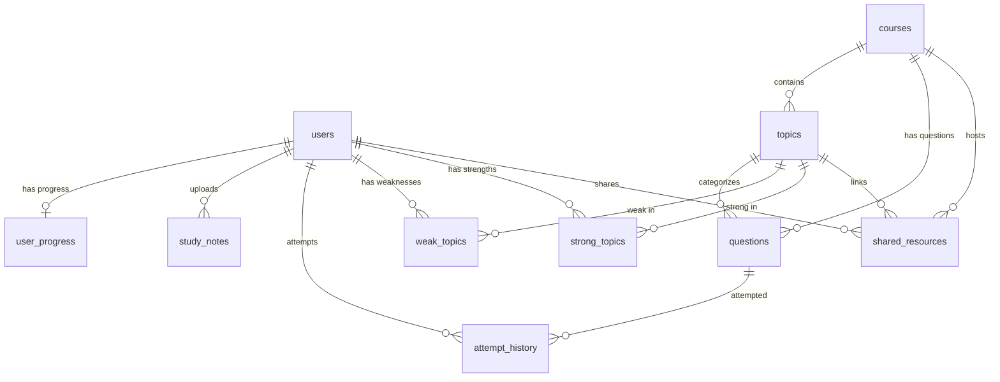

# CHAPTER FOUR: SYSTEM DESIGN AND IMPLEMENTATION

## 4.1 Introduction
This chapter details the technical design and actual implementation of **Revisio** (the AI-Assisted Exam Preparation and Study Support System). Decoupling the system's logical specifications from its physical deployment ensures that the user interface, backend routing controllers, and database access routines remain maintainable and scalable.

The system is realized through a modular three-tier client-server structure: a **React-Vite** single-page frontend application, a **Node.js-Express** backend API server, and a **Supabase PostgreSQL** cloud database engine. 

Section 4.2 details the relational database schema design, including primary/foreign keys, entity integrity constraints, and database indices. Section 4.3 outlines the API endpoint specifications, detailing the RESTful routes, input validation schemas, and client-server request-response lifecycles. Section 4.4 presents the user interface implementation, detailing the functional components and user flows alongside corresponding screenshot placeholders. Section 4.5 concludes the chapter with a summary of the system design.

---

## 4.2 Database Schema Design
Revisio uses a relational database model implemented on PostgreSQL via Supabase. Relational models ensure strict data integrity, consistent relationships across tables, and support for complex aggregate query operations (such as compiling weakness tracking data and weekly accuracy statistics). 

Figure 4.1 maps the relational entity-relationship diagrams (ERD) and cascading linkages among the tables.


*Figure 4.1: Entity-Relationship Diagram of the Revisio Database.*

### 4.2.1 Table: users
Stores core user profiles, display preferences, and academic programs to allow personalized study assistance. Note that authentication hashes are handled securely inside Supabase Auth, while this table stores metadata.

| Column Name | Data Type | Constraints | Description / Purpose |
| :--- | :--- | :--- | :--- |
| `id` | UUID | PRIMARY KEY, DEFAULT `gen_random_uuid()` | Unique identifier linked to Supabase Auth. |
| `email` | VARCHAR(255) | UNIQUE, NOT NULL | Student email address. |
| `display_name` | VARCHAR(100) | NULL | Student's chosen display name. |
| `program` | VARCHAR(100) | NULL, INDEXED | University academic major (e.g., Computer Science). |
| `created_at` | TIMESTAMP TZ | DEFAULT `NOW()` | Timestamp of profile registration. |
| `updated_at` | TIMESTAMP TZ | DEFAULT `NOW()` | Timestamp of profile configuration changes. |

### 4.2.2 Table: courses
Stores course structures and catalog descriptions.

| Column Name | Data Type | Constraints | Description / Purpose |
| :--- | :--- | :--- | :--- |
| `id` | UUID | PRIMARY KEY, DEFAULT `gen_random_uuid()` | Unique identifier of the course. |
| `name` | VARCHAR(255) | NOT NULL | Full course name. |
| `code` | VARCHAR(50) | UNIQUE, NOT NULL, INDEXED | Course code identifier (e.g., CSC305). |
| `icon` | VARCHAR(100) | NULL | String reference representing the UI icon. |
| `color` | VARCHAR(50) | NULL | Hex color code for dashboard themes. |
| `created_at` | TIMESTAMP TZ | DEFAULT `NOW()` | Timestamp of course registration. |

### 4.2.3 Table: topics
Segments courses into specific revision topics.

| Column Name | Data Type | Constraints | Description / Purpose |
| :--- | :--- | :--- | :--- |
| `id` | UUID | PRIMARY KEY, DEFAULT `gen_random_uuid()` | Unique identifier of the topic. |
| `name` | VARCHAR(255) | NOT NULL | Topic description header. |
| `course_id` | UUID | NOT NULL, REFERENCES `courses(id)` ON DELETE CASCADE | Parent course reference. |
| `created_at` | TIMESTAMP TZ | DEFAULT `NOW()` | Timestamp of topic creation. |

### 4.2.4 Table: questions
Stores AI-generated active-recall quiz questions and explanations.

| Column Name | Data Type | Constraints | Description / Purpose |
| :--- | :--- | :--- | :--- |
| `id` | UUID | PRIMARY KEY, DEFAULT `gen_random_uuid()` | Unique question identifier. |
| `course_id` | UUID | NOT NULL, REFERENCES `courses(id)` ON DELETE CASCADE | Parent course index. |
| `topic_id` | UUID | NOT NULL, REFERENCES `topics(id)` ON DELETE CASCADE | Parent topic index. |
| `difficulty` | VARCHAR(20) | NOT NULL, CHECK IN ('easy', 'medium', 'hard') | Question difficulty level. |
| `type` | VARCHAR(20) | NOT NULL, CHECK IN ('multiple-choice', 'true-false') | Question formats. |
| `question_text` | TEXT | NOT NULL | The text content of the question. |
| `options` | JSONB | NOT NULL | JSON array containing exactly 4 multiple-choice options. |
| `correct_answer`| TEXT | NOT NULL | The correct answer string. |
| `explanation` | TEXT | NULL | AI-generated rationale explaining the correct answer. |
| `common_mistakes`| TEXT[] | NULL | Optional array detailing common student errors. |
| `hints` | TEXT[] | NULL | Optional array of hints. |
| `year` | INTEGER | NULL | Optional academic year reference. |
| `created_at` | TIMESTAMP TZ | DEFAULT `NOW()` | Timestamp of question compilation. |

### 4.2.5 Table: study_notes
Stores raw text parsed from uploaded PDF slides.

| Column Name | Data Type | Constraints | Description / Purpose |
| :--- | :--- | :--- | :--- |
| `id` | UUID | PRIMARY KEY, DEFAULT `gen_random_uuid()` | Unique document index. |
| `user_id` | UUID | NOT NULL, REFERENCES `users(id)` ON DELETE CASCADE | Owner identification index. |
| `title` | VARCHAR(255) | NOT NULL | Slide title header. |
| `content` | TEXT | NULL | Extracted PDF text content (PDF-to-text parsed output). |
| `file_url` | VARCHAR(500) | NULL | CDN URL pointing to the raw PDF in Cloudinary. |
| `created_at` | TIMESTAMP TZ | DEFAULT `NOW()` | Timestamp of document upload. |
| `updated_at` | TIMESTAMP TZ | DEFAULT `NOW()` | Timestamp of note modifications. |

### 4.2.6 Table: user_progress
Tracks overall metrics and study streaks for learning analytics.

| Column Name | Data Type | Constraints | Description / Purpose |
| :--- | :--- | :--- | :--- |
| `user_id` | UUID | PRIMARY KEY, REFERENCES `users(id)` ON DELETE CASCADE | Owner reference index. |
| `total_attempted`| INTEGER | DEFAULT 0 | Cumulative question attempts. |
| `correct_answers`| INTEGER | DEFAULT 0 | Cumulative correct submissions. |
| `wrong_answers` | INTEGER | DEFAULT 0 | Cumulative incorrect submissions. |
| `streak_days` | INTEGER | DEFAULT 0 | Consecutive active revision days. |
| `last_activity_date`| DATE | NULL | Date of last registered quiz submission. |
| `created_at` | TIMESTAMP TZ | DEFAULT `NOW()` | Profile stats creation date. |
| `updated_at` | TIMESTAMP TZ | DEFAULT `NOW()` | Profile stats recalculation date. |

### 4.2.7 Table: attempt_history
Logs individual student answer choices to calculate topic accuracy and time-spent diagnostics.

| Column Name | Data Type | Constraints | Description / Purpose |
| :--- | :--- | :--- | :--- |
| `id` | UUID | PRIMARY KEY, DEFAULT `gen_random_uuid()` | Unique attempt tracker index. |
| `user_id` | UUID | NOT NULL, REFERENCES `users(id)` ON DELETE CASCADE | Student identifier. |
| `question_id` | UUID | NOT NULL, REFERENCES `questions(id)` ON DELETE CASCADE | Answered question reference. |
| `student_answer`| TEXT | NOT NULL | String value submitted by the student. |
| `is_correct` | BOOLEAN | NOT NULL | Evaluation correctness result. |
| `time_spent_seconds`| INTEGER | NULL | Timer metric capturing response time. |
| `attempted_at` | TIMESTAMP TZ | DEFAULT `NOW()` | Submission timestamp. |

### 4.2.8 Tables: weak_topics & strong_topics
These join tables track learning weaknesses and strengths respectively, and are recalculated on each attempt to power the dashboard's recommendations. A topic is flagged as weak if the accuracy percentage is below 60.00%, and strong if it exceeds 80.00%.

| Column Name | Data Type | Constraints | Description / Purpose |
| :--- | :--- | :--- | :--- |
| `user_id` | UUID | FOREIGN KEY, REFERENCES `users(id)` ON DELETE CASCADE | The student UUID index. |
| `topic_id` | UUID | FOREIGN KEY, REFERENCES `topics(id)` ON DELETE CASCADE | The topic UUID index. |
| `accuracy_percentage`| DECIMAL(5,2)| NOT NULL | Calculated topic accuracy score. |
| `last_attempted`| TIMESTAMP TZ | DEFAULT `NOW()` | Last attempt timestamp. |

*Note: The primary key of both tables is a composite key: `(user_id, topic_id)`.*

---

## 4.3 API Endpoint Specification
The Express backend acts as a headless RESTful API server. It executes business logic, manages token validation, handles PDF document text extraction, and processes incoming requests. Zod schemas validate request structures before database or AI API operations occur.

### 4.3.1 Authentication Routes (`/api/auth`)
* **`POST /api/auth/register`**
  * *Description:* Creates a new user profile and triggers Supabase identity provider registration.
  * *Payload:* `{ email, password, display_name, program }`
  * *Response:* `201 Created` with JWT Session payload.
* **`POST /api/auth/login`**
  * *Description:* Authenticates email and password credentials.
  * *Payload:* `{ email, password }`
  * *Response:* `200 OK` with JWT Token and student display profile details.

### 4.3.2 Note Management & Document Processing (`/api/notes`)
* **`POST /api/notes/upload`**
  * *Description:* Multipart form-data parser uploading a PDF slides file to Cloudinary and extracting text contents.
  * *Payload:* Form-data object containing `file`, `title`, `course_id`, `topic_id`.
  * *Response:* `201 Created` returning `{ noteId, title, fileUrl, extractedLength }`.
* **`GET /api/notes`**
  * *Description:* Retrieves all notes uploaded by the logged-in student.
  * *Response:* `200 OK` with JSON array of notes.
* **`DELETE /api/notes/:noteId`**
  * *Description:* Deletes a specific study note, cascading to remove its questions and attempts.
  * *Response:* `200 OK` confirming deletion.

### 4.3.3 AI Cognitive & Question Services (`/api/ai`)
* **`POST /api/ai/generate-questions`**
  * *Description:* Fetches study note text, constructs a system prompt, queries Gemini 2.5 Flash, parses the JSON array output, saves questions to the database, and returns them.
  * *Payload:* `{ noteId, count, difficulty }`
  * *Response:* `200 OK` with structured array of questions: `[{ id, question_text, options, explanation }]`.
* **`POST /api/ai/summarize`**
  * *Description:* Generates a 3-5 point bulleted summary of the uploaded slide notes content.
  * *Payload:* `{ noteId }`
  * *Response:* `200 OK` returning `{ summary: string }`.
* **`POST /api/ai/chat`**
  * *Description:* Initiates a Socratic conversation with Revi. Passes the student's program and context note to customize explanations.
  * *Payload:* `{ message, history: [...], programContext, noteContext }`
  * *Response:* `200 OK` returning `{ response: string }`.

### 4.3.4 Attempts & Progress Analytics (`/api/attempts` & `/api/users`)
* **`POST /api/attempts`**
  * *Description:* Submits a selected option, calculates correctness, logs the attempt, and recalculates streaks and weak/strong topic statuses.
  * *Payload:* `{ questionId, studentAnswer, timeSpentSeconds }`
  * *Response:* `200 OK` returning `{ correct: boolean, correctAnswer: string, explanation: string }`.
* **`GET /api/users/progress`**
  * *Description:* Compiles cumulative metrics (total, correct, wrong, streaks) for the progress widgets.
  * *Response:* `200 OK` returning statistical objects.
* **`GET /api/users/weak-topics`**
  * *Description:* Fetches all topics where user accuracy falls below 60%, used to trigger warning cards.
  * *Response:* `200 OK` with lists of topic records.

---

## 4.4 User Interface Implementation
The frontend is designed with a premium, responsive dark-mode-first aesthetic. It uses TailwindCSS variables, smooth transition animations, and accessible component architectures built via Radix UI. 

### 4.4.1 User Authentication
The registration and login portals serve as the access entry points for students (Figure 4.2). They utilize form controllers validating password metrics (enforcing a minimum of 8 characters) and email formatting prior to firing API requests. The state engine captures the authentication token and persists the session.

```
+-------------------------------------------------------------+
|                        REVISIO                              |
|                                                             |
|   [ Create Account ]                                         |
|   Register with email to personalize your study sessions.   |
|                                                             |
|   Display Name:  [ Abdul Razak ]                            |
|   Email Address: [ abdul@uds.edu.gh ]                       |
|   Academic Major:[ Computer Science ]                       |
|   Password:      [ ******** ]                               |
|                                                             |
|                   (( Create Account ))                      |
|                                                             |
|   Already have an account? Log In                           |
+-------------------------------------------------------------+
```
*Figure 4.2: Registration interface layout.*

### 4.4.2 Document Upload and Processing Panel
Located in the **Study Notes** view, this component provides a drag-and-drop boundary supporting PDF lecture note ingestion (Figure 4.3). A loading spinner replaces the uploader when files are selected, providing real-time status updates as the file is pushed to Cloudinary and parsed by `pdf-parse` in the backend.

```
+-------------------------------------------------------------+
|  Study Notes / Upload Lectures                              |
|                                                             |
|   +-----------------------------------------------------+   |
|   |            Drag and drop your PDF here              |   |
|   |                       - or -                        |   |
|   |                 [ Browse Files ]                    |   |
|   +-----------------------------------------------------+   |
|                                                             |
|   Uploaded Notes:                                           |
|   - CSC 305: Database Systems Lecture 1.pdf  [Delete] [Quiz]|
+-------------------------------------------------------------+
```
*Figure 4.3: Study notes PDF file uploader panel.*

### 4.4.3 Practice Portal and AI Quiz Generator Setup
The Practice Portal lists the student's uploaded notes grouped by course. The portal provides configuration controls (Figure 4.4) allowing students to choose difficulty levels (Easy, Medium, Hard) and question counts (10, 20, 25) before initiating question compilation.

```
+-------------------------------------------------------------+
|  Custom Practice Quiz Setup                                 |
|                                                             |
|   Selected Note: Database Systems - Lecture 1               |
|                                                             |
|   Difficulty:  ( ) Easy     (o) Medium    ( ) Hard          |
|   Questions:   ( ) 10       (o) 20        ( ) 25            |
|                                                             |
|                   (( Generate Quiz ))                       |
+-------------------------------------------------------------+
```
*Figure 4.4: Quiz customization setup options panel.*

### 4.4.4 AI Quiz Generation and Processing Status
When a quiz generation is initiated, an overlay displays compilation progress (e.g., "Reading slides...", "Synthesizing options..."). This overlay includes a progress bar and displays random learning tips to improve student engagement during compilation (Figure 4.5).

```
+-------------------------------------------------------------+
|                   Generating Custom Quiz                    |
|                                                             |
|                       [ ======= 68% ]                       |
|                                                             |
|               "Analyzing document concepts..."             |
|                                                             |
|   Tip: Immediate, Socratic feedback on errors promotes      |
|   retention. Ask Revi to explain any wrong answer!          |
+-------------------------------------------------------------+
```
*Figure 4.5: Loading state progress screen.*

### 4.4.5 Interactive Practice Session and AI Feedback Panel
During a practice session, students see one question at a time (Figure 4.6). After selecting an option and submitting their response, the correct choice is highlighted in green, incorrect choices are highlighted in red, and an AI-generated explanation is displayed. An "Ask Revi" button opens the chat widget to clarify mistakes.

```
+-------------------------------------------------------------+
|  Practice Session (Question 3 of 10)                         |
|                                                             |
|   Which normal form addresses transitive dependencies?      |
|                                                             |
|   [ ] A. 1NF                                                |
|   [x] B. 2NF  <-- Incorrect (Selected)                      |
|   [*] C. 3NF  <-- Correct Answer                            |
|   [ ] D. BCNF                                               |
|                                                             |
|   AI Explanation: Transitive dependencies are removed       |
|   in 3rd Normal Form (3NF) by isolating non-prime fields.   |
|                                                             |
|             (( Ask Revi ))            (( Next ))            |
+-------------------------------------------------------------+
```
### 4.4.6 Student Dashboard and Progress Overview
The primary landing dashboard displays statistical widgets (Figure 4.7). Total attempts, correct answers, wrong answers, and study streaks are displayed in a card grid. A Recharts line-bar graph visualizes daily accuracy trends over the past seven days.

```
+-------------------------------------------------------------+
|  Student Dashboard                                          |
|                                                             |
|  [Total: 142]   [Correct: 98]   [Wrong: 44]   [Streak: 5d]  |
|                                                             |
|  Weekly Performance Chart:                                  |
|   Attempts |    *         *                                 |
|            |    *    *    *    *                            |
|    Correct |    *    *    *    *    *                       |
|            +-------------------------                       |
|               Mon  Tue  Wed  Thu  Fri                       |
+-------------------------------------------------------------+
```
*Figure 4.7: Main landing dashboard layout.*

### 4.4.7 Conversational Socratic AI Chat Interface
This chat interface is available throughout the application (Figure 4.8). The chatbot, **Revi**, uses a Socratic style to guide students step-by-step. Revi leverages the student's program major to tailor explanations (e.g., using programming analogies for Computer Science majors).

```
+-------------------------------------------------------------+
| Revi Study Assistant                                    [X] |
|                                                             |
|  Revi: Welcome back, Abdul! As a Computer Science major,     |
|        how can I help you debug your understanding today?    |
|                                                             |
|  User: [Explain 3NF database normalization...        ] (Send)|
+-------------------------------------------------------------+
```
*Figure 4.8: Socratic conversational AI chat widget.*

### 4.4.8 Performance Analytics and Milestones Dashboard
The Analytics tab aggregates performance metrics (Figure 4.9). In addition to displaying a breakdown of weak and strong topics, this tab features a gamified milestones system that unlocks badges (e.g., "Note Scholar" for uploading 5 notes, "Streak Master" for maintaining a 7-day streak).

```
+-------------------------------------------------------------+
|  Performance Analytics                                      |
|                                                             |
|   Weak Topics:                          Strong Topics:      |
|   - Database Normalization (45%)       - SQL Joins (88%)    |
|   - Query Optimization (50%)           - Indexing (92%)     |
|                                                             |
|   Unlocked Milestones:                                      |
|   [ Badge: Note Scholar ]     [ Badge: 5-Day Streak ]       |
+-------------------------------------------------------------+
```
*Figure 4.9: Performance analytics and achievements view.*

---

## 4.5 Chapter Summary
This chapter detailed the technical design and actual implementation of Revisio. The database schema design was mapped, showcasing how relational integrity is maintained across 10 tables inside Supabase PostgreSQL to prevent data inconsistencies and power learning analytics calculations. Next, the RESTful API endpoints were cataloged, detailing how controllers process note uploads, file storage, AI operations, and attempts submission. Lastly, the user interface was walked through, detailing how functional views are realized to provide a cohesive revision experience.

The next chapter (Chapter Five) presents the evaluations, experimental test results, user feedback analysis, conclusions, and future directions of the research project.

